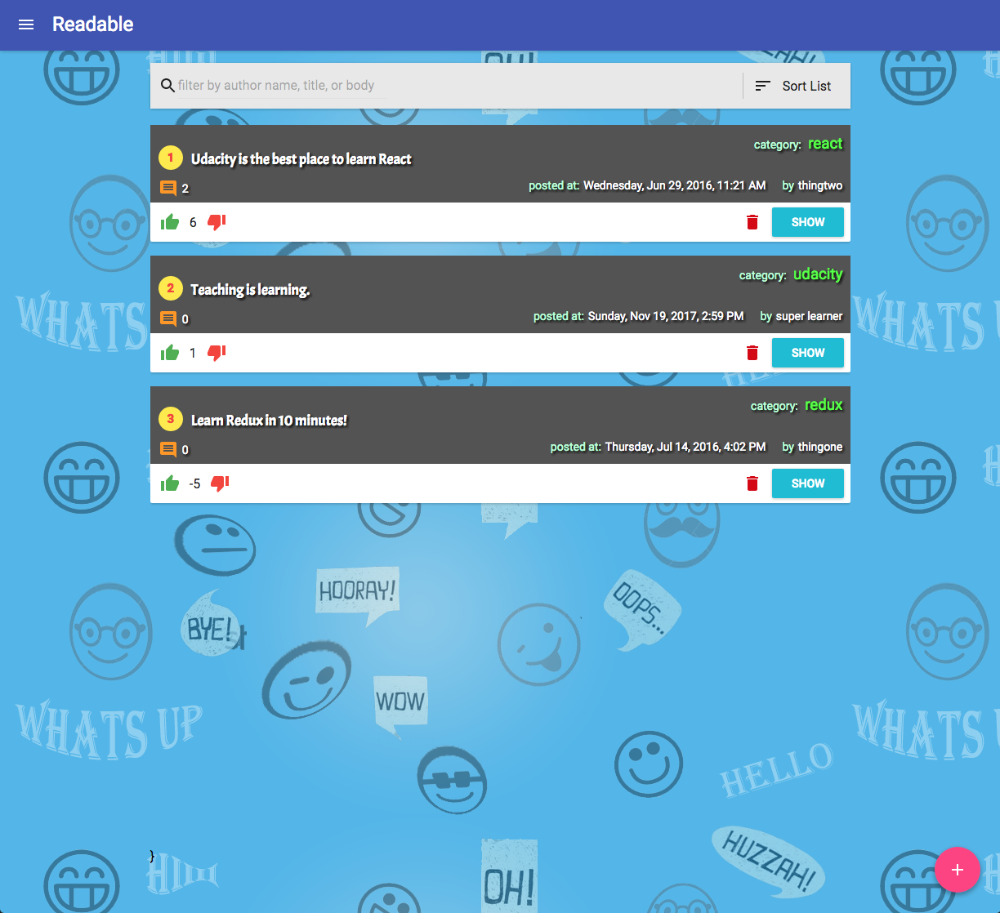
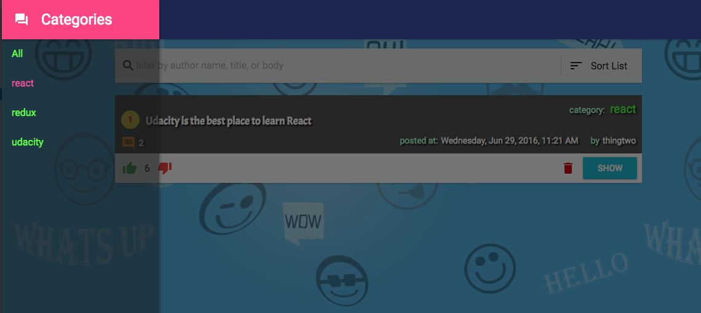
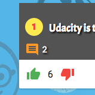
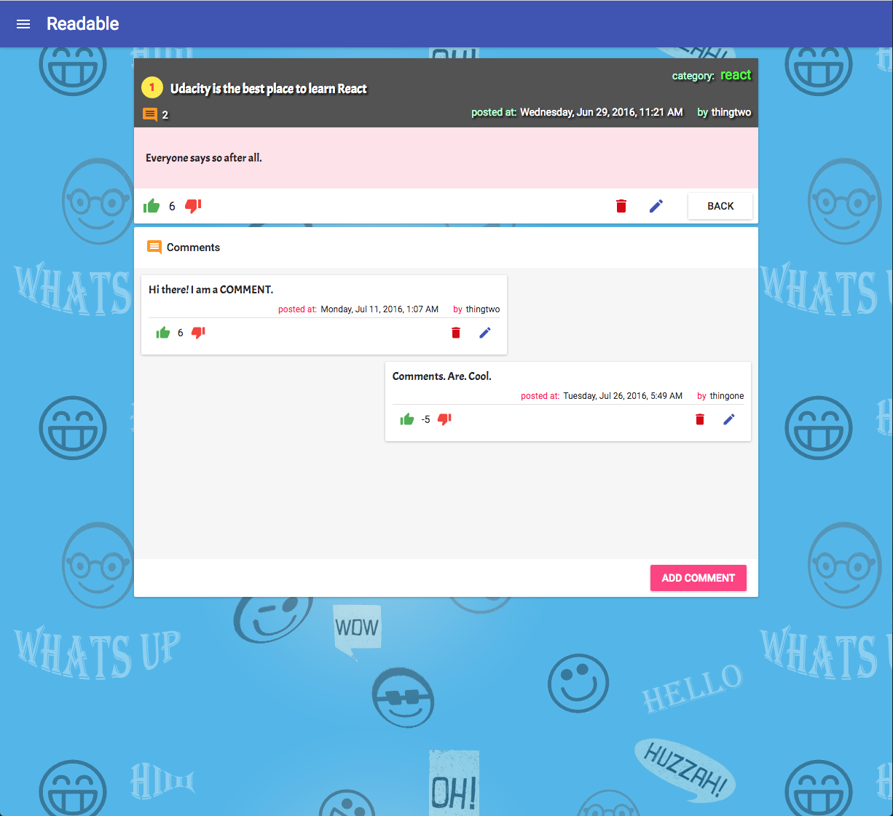
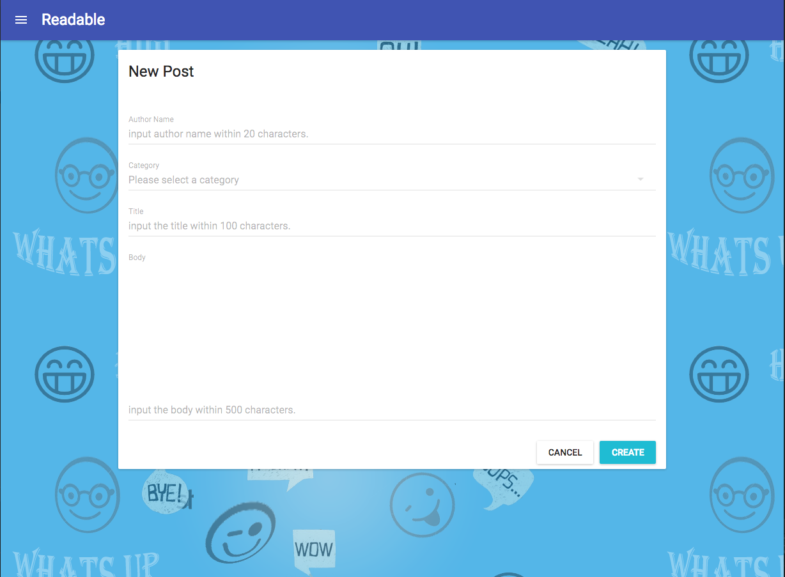
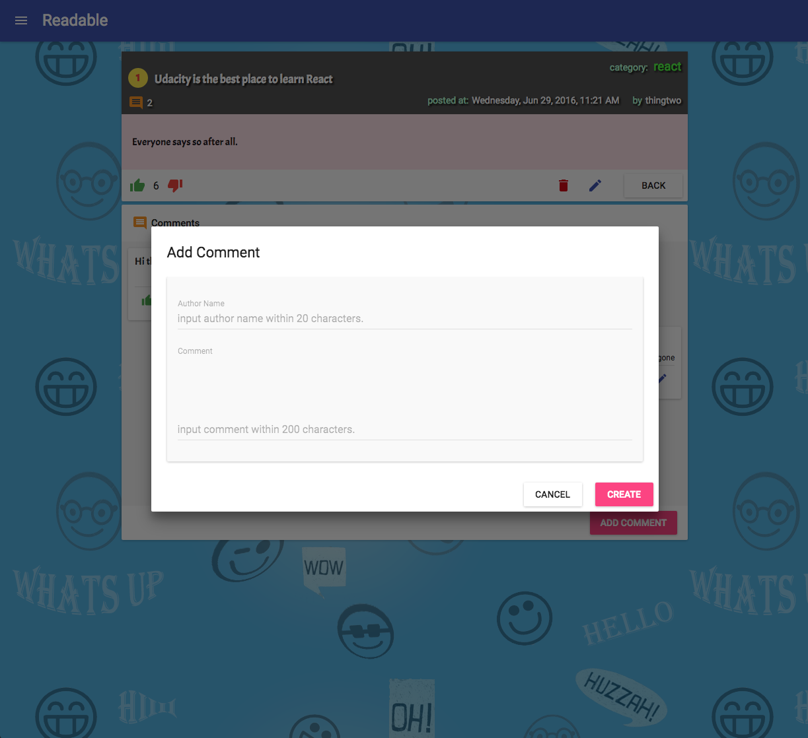

# Readable
## Udacity React ND 2nd project
### Getting started
##### 1. Open your terminal and clone this repository in a directory you like:
```
$ git clone https://github.com/nekki-t/reactnd-project-readable.git
```
##### 2.  Download API server app in the same directory as above:
```
$ git clone https://github.com/udacity/reactnd-project-readable-starter.git
```
##### 3.  Install and start the API server:
```
$ cd reactnd-project-readable-starter/api-server
$ npm install
$ node server
```
##### 4. Install and start Readable:
```
$ cd ../../reactnd-project-readable-frontend
$ npm install
(or yarn)
$ npm start
(or yarn start)
```
## What you are able to
### 1. Read a list of posts ranked by voting of users

### 2. Filter by a category

### 3. Vote posts

### 4. See comments on each post

### 5. Create & Edit posts

### 6. Create & Edit comments
